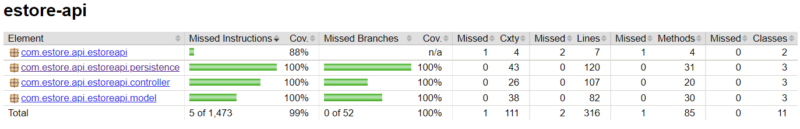

# PROJECT Design Documentation

## Team Information
* Team name: Crocky's Cohort
* Team members
  * Alex Vernes
  * Holden Lalumiere
  * Stevie Alvarez
  * Isaac McKinney
  * Tylin Hartman

## Executive Summary

### Purpose
The project will be a website of an online e-store called "Crocky's Crochet", where various crochet products are sold. Customers can browse and purchase products and the administrator can manage the inventory through the website. 

### Glossary and Acronyms
| Term | Definition |
|------|------------|
| MVP | Minimum Viable Product |

## Requirements

### Definition of MVP
- A Customer can login with a username into the e-store. Customers can browse and search for products and also add those products to their shopping cart. When that customer logins in later, the products that were in their shopping cart from a previous login are still there. 
- The Admin can login with a special Admin-only username into the e-store. The Admin can edit, add, and remove and generally manage the inventory of the e-store. 

### MVP Features
- Customer can login
- Customer can browse products
- Customer can search products
- Customer can add products to their shopping cart
- Admin can login
- Admin can manage the inventory of the e-store

### Roadmap of Enhancements
1. Customer can browse products
2. Customer can search products
3. Admin can manage the inventory of the e-store
4. Customer can login
5. Admin can login
6. Customer can add products to their shopping cart

## Application Domain

In the domain model, firstly, there are two kinds of Users that can login to Crocky's Crochet, an Admin and a Customer. 
Crocky's Crochet displays for Users the products that are in the inventory. 
The Admin can manage those products that are in inventory. 
A Customer can browse the products displayed by Crocky's Crochet and can add products to their shopping cart. 
A Customer can proceed to the checkout with the products in their shopping cart, making the purchase complete. 

## Architecture and Design

The files will be split into two sections, the e-store UI and the e-store API. 
The e-store UI is contains all components that are part of every webpage for the e-store. 
The e-store API is split further into three subsections, controller, model, and persistence. 
Controller mediates communication between the front-end and the back-end in terms of data stored. Model provides a platform for viewing and modelling the data stored. Persistence provides a method of manipulating the data stored. 

### Summary

The following Tiers/Layers model shows a high-level view of the webapp's architecture.

The e-store web application, is built using the Model–View–ViewModel (MVVM) architecture pattern. 

The Model stores the application data objects including any functionality to provide persistance. 

The View is the client-side SPA built with Angular utilizing HTML, CSS and TypeScript. The ViewModel provides RESTful APIs to the client (View) as well as any logic required to manipulate the data objects from the Model.

Both the ViewModel and Model are built using Java and Spring Framework. Details of the components within these tiers are supplied below.

### Overview of User Interface

### View Tier
<!-- > _Provide a summary of the View Tier UI of your architecture.
> Describe the types of components in the tier and describe their
> responsibilities.  This should be a narrative description, i.e. it has
> a flow or "story line" that the reader can follow._

> _You must also provide sequence diagrams as is relevant to a particular aspects 
> of the design that you are describing.  For example, in e-store you might create a 
> sequence diagram of a customer searching for an item and adding to their cart. 
> Be sure to include an relevant HTTP reuqests from the client-side to the server-side 
> to help illustrate the end-to-end flow._ -->

Customers open the webpage to a generic product serach page, displaying the all prodcuts currently in the inventory. 
The Customer can click "login" and be taken to the login page, where they can either login with an existing username or create a new account. 
Now that the Customer is logged in, when clicking in a product, the option to add that prodcut to the cart displays alongside other information about that product. 
The Customer can add products to their shopping cart. 
The Customer can also remove the item or proceed to checkout, where it clears all products in the cart. 
When the Admin logs in, the same display of products is shown alongside the "New Product" button. 
When the Admin clicks on a product, they can edit the information for that product or delete the product. 

### ViewModel Tier
<!-- > _Provide a summary of this tier of your architecture. This
> section will follow the same instructions that are given for the View
> Tier above._

> _At appropriate places as part of this narrative provide one or more
> static models (UML class diagrams) with some details such as critical attributes and methods._ -->

### Model Tier
<!-- > _Provide a summary of this tier of your architecture. This
> section will follow the same instructions that are given for the View
> Tier above._

> _At appropriate places as part of this narrative provide one or more
> static models (UML class diagrams) with some details such as critical attributes and methods._ -->

### Static Code Analysis/Design Improvements
<!-- > _Discuss design improvements that you would make if the project were
> to continue. These improvement should be based on your direct
> analysis of where there are problems in the code base which could be
> addressed with design changes, and describe those suggested design
> improvements._

> _With the results from the Static Code Analysis exercise, 
> discuss the resulting issues/metrics measurements along with your analysis
> and recommendations for further improvements. Where relevant, include 
> screenshots from the tool and/or corresponding source code that was flagged._ -->

## Testing
<!-- > _This section will provide information about the testing performed
> and the results of the testing._ -->

### Acceptance Testing
<!-- > _Report on the number of user stories that have passed all their
> acceptance criteria tests, the number that have some acceptance
> criteria tests failing, and the number of user stories that
> have not had any testing yet. Highlight the issues found during
> acceptance testing and if there are any concerns._ -->

### Unit Testing and Code Coverage

After each collection of files were writen, such that it is ensured that they will not be edited later, a team member or two were assigned to write unit tests for those files. The code coverage is 99% complete with the exception of the main method. 
We did not excpect to get that much code coverage in this sprint, but with efficient code writing we were able to go beyond the excpected 90%. 